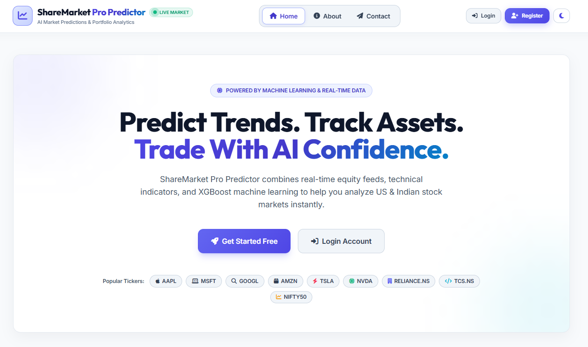
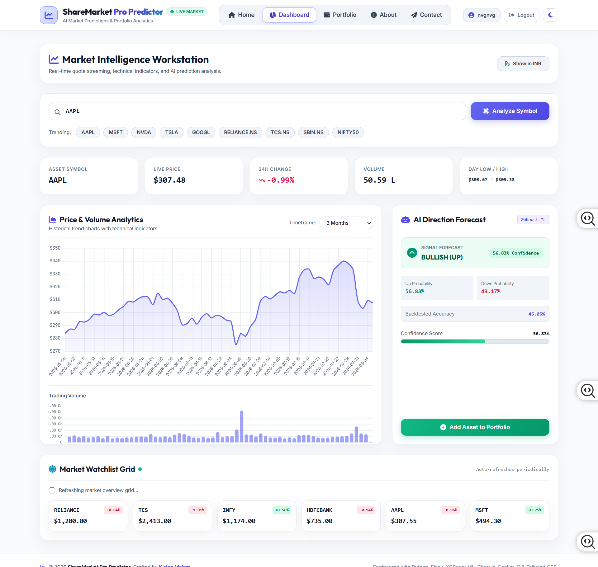

# 📈 ShareMarket Pro Predictor

<div align="center">

### AI Powered Stock Market Prediction Platform

Predict stock market direction using **Machine Learning**, **XGBoost**, **Technical Indicators**, and **Real-Time Market Data**.

---


</div>

---

# 📷 Project Banner



---

# 📌 Overview

ShareMarket Pro Predictor is an AI-powered stock market prediction web application developed using **Python, Flask, XGBoost, Flask-SocketIO, SQLite, and Technical Analysis** libraries.

The application provides users with live market information, technical indicators, machine learning predictions, and portfolio management through an intuitive and responsive dashboard.

This project demonstrates practical implementation of Machine Learning in financial market analysis and serves as a complete portfolio project.

---

# 🚀 Live Demo

> Coming Soon (Render Deployment)

---

# ✨ Features

## 👤 Authentication

- Secure User Registration
- Secure Login
- Password Encryption
- Session Management

---

## 📊 Live Stock Market

- Real-Time Stock Data
- Company Information
- Latest Price
- Price Change
- Trading Volume

---

## 🤖 AI Prediction

- XGBoost Machine Learning Model
- Stock Direction Prediction
- Buy / Sell Signal
- Prediction Confidence

---

## 📈 Technical Analysis

- RSI Indicator
- Moving Average
- Trend Detection
- Volume Analysis

---

## 👨‍💼 User Dashboard

- Personalized Dashboard
- Portfolio Overview
- Market Summary
- Prediction History

---

## ⚡ Real-Time Updates

- Flask-SocketIO
- Live Price Updates
- Instant Market Refresh

---

# 🖼️ Screenshots

## 🏠 Home Page


---

## 🔐 Login Page


---

## 📝 Register Page


---

## 📊 Dashboard



---

## 🤖 Prediction


---

## 💼 Portfolio


---

## 📈 Live Market


---

## 📉 Chart Analysis


---

## 📊 Technical Indicators


---

# 🏗️ System Architecture


---

# 🤖 Machine Learning Workflow


---

# 🛠️ Technology Stack

## Frontend

- HTML5
- CSS3
- Bootstrap
- JavaScript

## Backend

- Python
- Flask
- Flask-SocketIO

## Machine Learning

- XGBoost
- Scikit-Learn
- Pandas
- NumPy
- TA Library

## Database

- SQLite

---

# 📂 Project Structure

```text
ShareMarket_Pro_Predictor/
│
├── app/
├── assets/
├── instance/
├── models/
├── run.py
├── config.py
├── requirements.txt
├── Procfile
└── README.md
```

---

# ⚙️ Installation

Clone Repository

```bash
git clone https://github.com/kirtanmalam03/ShareMarket_Pro_Predictor.git
```

Move to Project

```bash
cd ShareMarket_Pro_Predictor
```

Create Virtual Environment

```bash
python -m venv venv
```

Activate Virtual Environment

### Windows

```bash
venv\Scripts\activate
```

Install Dependencies

```bash
pip install -r requirements.txt
```

Run Application

```bash
python run.py
```

Open Browser

```text
http://127.0.0.1:5000
```

---

# 🧠 Machine Learning Model

The application uses an **XGBoost Classification Model** trained on historical stock market data.

### Prediction Inputs

- Closing Price
- Trading Volume
- RSI
- Moving Average
- Market Trend
- Technical Indicators

### Prediction Output

- 📈 Bullish
- 📉 Bearish

---

# 🔮 Future Enhancements

- Portfolio Analytics
- News Sentiment Analysis
- Multiple AI Models
- Cryptocurrency Prediction
- Email Alerts
- Watchlist
- Dark Mode
- Candlestick Pattern Recognition
- Cloud Database Integration

---

# 👨‍💻 Developer

**Kirtan Malam**

GitHub:

https://github.com/kirtanmalam03

---

# ⭐ Support

If you found this project useful, please give it a ⭐ on GitHub.

---

# 📜 License

This project is intended for educational, learning, and portfolio purposes.
